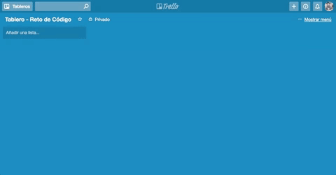

#Trello

Reto de código  

## Objetivo

El reto consiste en replicar el estilo y funcionalidad de una página sencilla en Trello. 

##Proceso
 
1. Identificar secciones del sitio y como abordarlas.

2. Maquetación. 

	2.1 Empezamos por definir 3 secciones: nav, menu, sección que contiene funcionaidad de js.  

	2.2 El nav se divide en otras 4 secciones: 

		2.2.1 Área de tablero

		2.2.2 Buscador

		2.2.3 Títilo de la página y logo.

		2.2.4. Iconos con enlace e imagen de perfil del usuario. 

	2.3 En el menu se contienen otros 4 elementos.  
  
	3. Sección donde se despliega funcionalidad. 

3. Funcionalidad de la página. 

	3.1 Cuadro de ingreso de texto, debe tener boton de envío. 

	3.2 El cuadro de texto se fija en el tablero y aparece uno nuevo. 

Este deberá ser el resultado aproximado: 

